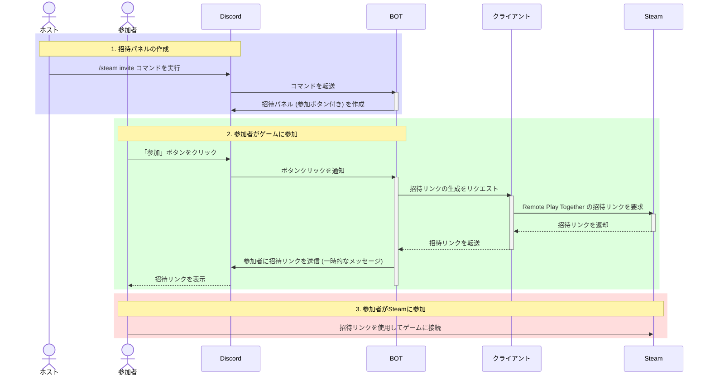

# Steam Remoteplay Inviter BOT

このリポジトリは、「Steam Remoteplay Inviter」ツールのバックエンドとして機能するDiscord BOTのソースコードを管理しています。

## BOTの役割

このBOTは、以下の主要な役割を担っています。

*   **招待パネルの作成と管理**: Discordのスラッシュコマンド (`/steam invite` など) を提供し、ユーザーがゲームの招待パネルを簡単に作成・管理できるようにします。
*   **ユーザーインタラクションの処理**: 参加者が招待パネルの「参加」ボタンを押した際のアクションを処理します。
*   **クライアントとの通信**: ホスト（ゲーム主催者）のマシンで動作するクライアントアプリケーションと通信し、Steam Remote Play Togetherの招待リンクの発行をリクエストし、受け取ります。

このBOTは、「Steam Remoteplay Inviter」エコシステムの中核をなすコンポーネントです。

## 関連リポジトリ

「Steam Remoteplay Inviter」プロジェクトは、複数のリポジトリに分かれています。

*   **[remoteplay-inviter-web](https://github.com/Kamesuta/remoteplay-inviter-web)**: プロジェクトの公式ウェブサイトです。
*   **[remoteplay-inviter](https://github.com/Kamesuta/remoteplay-inviter)**: ホストのPCで実行されるクライアントアプリケーションです。
*   **[remoteplay-inviter-bot](https://github.com/Kamesuta/remoteplay-inviter-bot)**: このリポジトリです。

## シーケンス図

